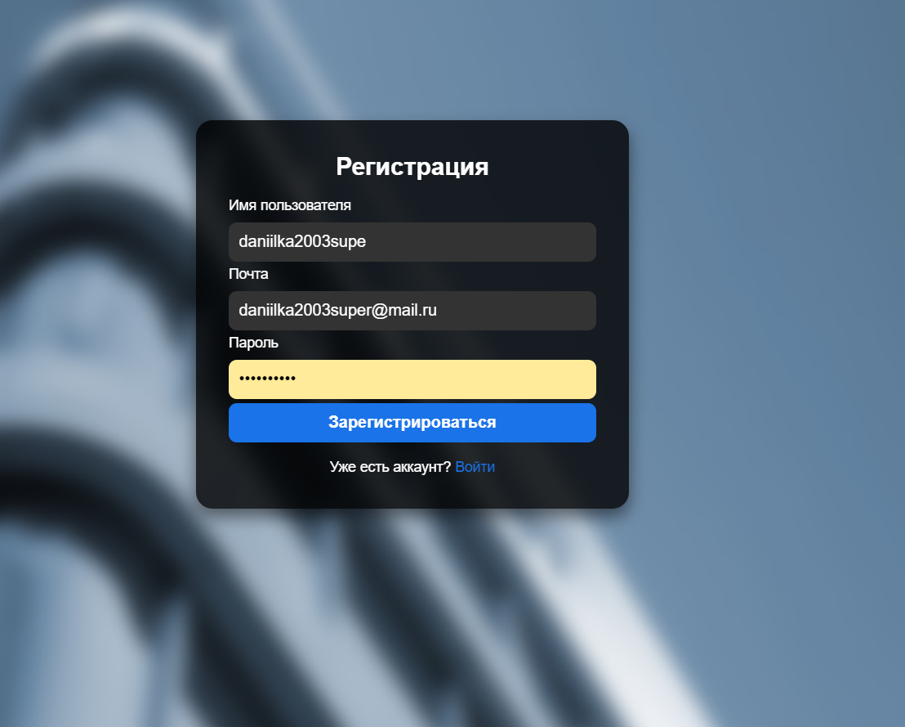
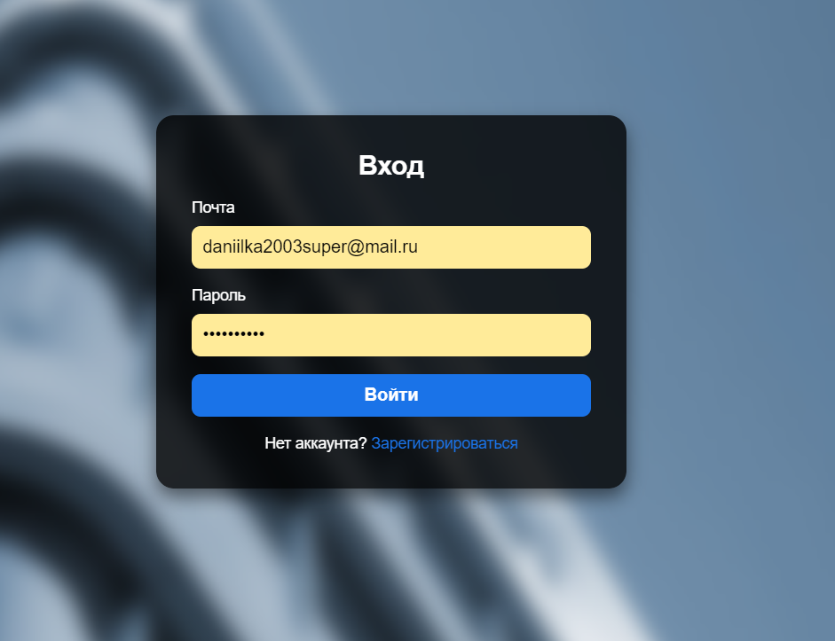
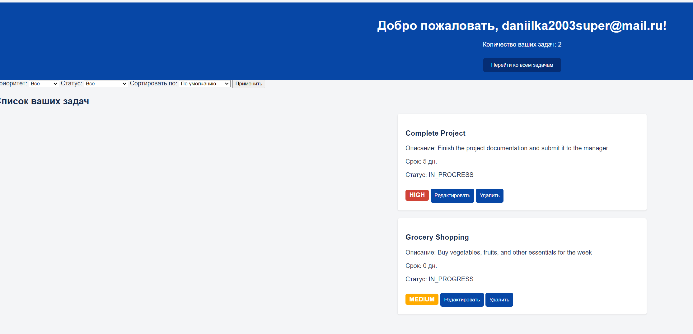
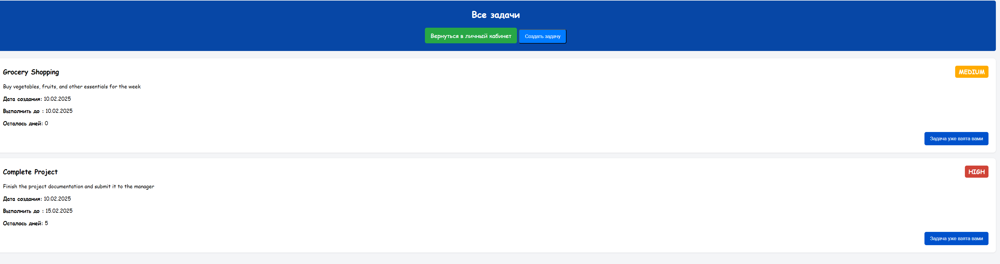

# TODO Application

## 📜 Описание

TODO-приложение для управления задачами. Пользователи могут создавать, редактировать, удалять и сортировать задачи, а также управлять своим списком задач после авторизации.

---

## ⚙️ Функционал

### Пользователь может:
1. **Создавать задачи**: указание названия, описания, срока выполнения.
2. **Просматривать список задач**: доступ ко всем своим задачам.
3. **Редактировать задачи**:
   - Изменять статус (`TODO`, `In Progress`, `Completed`).
   - Обновлять название, описание, срок выполнения.
4. **Удалять задачи**.
5. **Фильтровать задачи**: по статусу.
6. **Сортировать задачи**: по сроку выполнения или статусу.

### Авторизация и аутентификация:
- Доступ к задачам возможен только после входа в систему (логин/пароль).
- Каждый пользователь видит только свои задачи.
- Неавторизованные пользователи не имеют доступа.

---

## 🛠️ Технологический стек

- **Java** 17
- **Spring Boot**
- **Spring Security**
- **Spring MVC**
- **Spring Data JPA**
- **Hibernate**
- **Lombok**
- **PostgreSQL**
- **JUnit**
- **Mockito**
- **Gradle**

---

## 📸 Интерфейс приложения

### 1. **Страница регистрации**


### 2. **Страница входа**


### 3. **Кабинет пользователя**


### 4. **Все задачи**


---

## 🚀 Запуск проекта

### 1. Клонирование репозитория
```bash
git clone https://github.com/FkishDaniels/ToDo.git
cd ToDo
